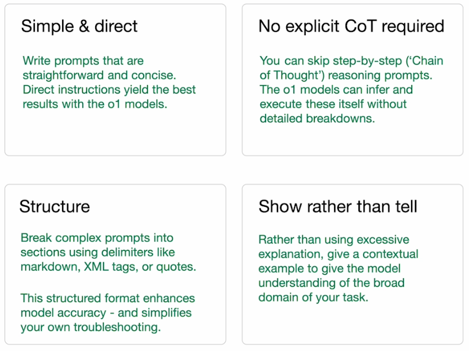
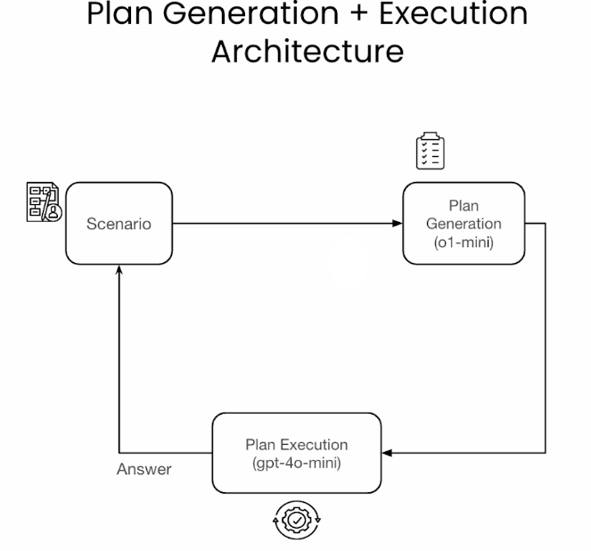

# Course Notes

Tips to prompt
* Be simply and Direct
* No explicit CoT required
* Structure the prompt with markdown for example. We can also give XML text to give instruction to the prompt if you want, for example, to make your model act like as a customer service assistance
```angular2html
structured_prompt = ("<instructions>You are a customer service assistant for AnyCorp, a provider"
          "of fine storage solutions. Your role is to follow your policy to answer the user's question. "
          "Be kind and respectful at all times.</instructions>\n"
          "<policy>**AnyCorp Customer Service Assistant Policy**\n\n"
            "1. **Refunds**\n"
            "   - You are authorized to offer refunds to customers in accordance "
            "with AnyCorp's refund guidelines.\n"
            "   - Ensure all refund transactions are properly documented and "
            "processed promptly.\n\n"
            "2. **Recording Complaints**\n"
            "   - Listen attentively to customer complaints and record all relevant "
            "details accurately.\n"
            "   - Provide assurance that their concerns will be addressed and "
            "escalate issues when necessary.\n\n"
            "3. **Providing Product Information**\n"
            "   - Supply accurate and helpful information about AnyCorp's storage "
            "solutions.\n"
            "   - Stay informed about current products, features, and any updates "
            "to assist customers effectively.\n\n"
            "4. **Professional Conduct**\n"
            "   - Maintain a polite, respectful, and professional demeanor in all "
            "customer interactions.\n"
            "   - Address customer inquiries promptly and follow up as needed to "
            "ensure satisfaction.\n\n"
            "5. **Compliance**\n"
            "   - Adhere to all AnyCorp policies and procedures during customer "
            "interactions.\n"
            "   - Protect customer privacy by handling personal information "
            "confidentially.\n\n6. **Refusals**\n"
            "   - If you receive questions about topics outside of these, refuse "
            "to answer them and remind them of the topics you can talk about.</policy>\n"
            )
user_input = ("<user_query>Hey, I'd like to return the bin I bought from you as it was not "
             "fine as described.</user_query>")
```
* Show rather than tell



* Reasoning with o1 is different than reasoning with other models. This is because the way the model was trained and built
* OpenAI (Closed AI) they found that by training a model using reinforcement learning to use chain-of-though, is better able to navigate reasoning tasks.

## Planning
The overall architecture of the task starts with a scenario which comes from a customer (e.g. Historia legal) that requires multi-step logic to answer that scenario. That scenario will be giving to o1-mini which will have at its disposal instructions of how to build a plan and a number of tools which it can use to carry out the plan. Then we engage with 4omini as a worker to carry out each task of the plan and when is done it will give an answer.



### Abstract Reasoning

### The generator-Verification gap


### Where is o1 good fit


### o1 Recap
* The o1 family of models scale compute at inference time by producing tokens to reason through the problem
* o1 gives you more intelligence as a trade-off against higher latency and cost
* it can also perform welll at takss that require a test and learn approach where it can iteratively verify its results
* Some grea emergin use cases are planning, coding, and domain-specific reasoning like law and STEM subjects

As officially stated in the course webside ([link](https://www.deeplearning.ai/short-courses/reasoning-with-o1/)), here are notebook for:
* Learn to recognize what tasks the o1 model is suited for and when you might want to use a smaller or faster model or combine those two.
* Understand four key principles of prompting using o1 from “simple and direct” to “show rather than tell,” and explore the difference in performance. 
* Implement a multi-step task in which o1 acts as an orchestrator creating a plan and handing it over to the 4o-mini model to execute the plan in sequence, balancing the trade-off between intelligence and cost. 
* Use o1 for a coding task to build a new application, edit existing code, and test performance by running a coding competition between o1-mini and GPT 4o. 
* Use o1 for image understanding and learn how it performs better with a hierarchy of reasoning, in which it incurs the latency and cost upfront, preprocessing the image and indexing it with rich details so it can be used for Q&A later. 
* Learn a technique called meta-prompting, in which you use o1 to improve your prompts. Using a customer support evaluation set, you iteratively use o1 to modify a prompt to improve performance.


References
[Research blog post](https://openai.com/index/learning-to-reason-with-llms/)